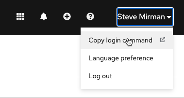
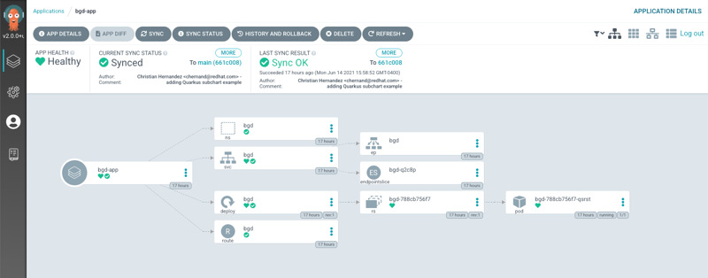
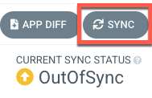

# Demonstrate GitOps on Managed OpenShift with ArgoCD

The purpose of this document is to help you get  OpenShift GitOps running in your cluster, including deploying a somple application and demonstrating how ArgoCD ensures environment consistency.

>This demo assumes you have a Managed OpenShift Cluster available and cluster-admin rights.

#### GitHub resources referenced in the demo:

BGD Application: [gitops-bgd-app](https://github.com/rh-mobb/gitops-bgd-app) <br>
OpenShift / ArgoCD configuration:  [gitops-demo](https://github.com/rh-mobb/gitops-demo)

#### Required command line (CLI) tools

- GitHub: [git](https://git-scm.com/download/)
- OpenShift: [oc](https://docs.openshift.com/container-platform/4.2/cli_reference/openshift_cli/getting-started-cli.html#cli-installing-cli_cli-developer-commands)
- ArgoCD: [argocd](https://argoproj.github.io/argo-cd/cli_installation/)
- Kustomize: [kam](https://kubectl.docs.kubernetes.io/installation/kustomize/)

## Environment Set Up

### Install the OpenShift GitOps operator

Install the **OpenShift GitOps** operator from the **Operator Hub**


### Pull files from GitHub

Clone the `gitops-demo` GitHub repository to your local machine
```
git clone https://github.com/rh-mobb/gitops-demo gitops
```

Export your local path to the GitHub files
```
export GITOPS_HOME="$(pwd)/gitops"
cd $GITOPS_HOME
```

### Log in to OpenShift via the CLI

Retrieve the login command from the OpenShift console <br>


Enter the command in your terminal to authenticate with the OpenShift CLI (oc)
>Output should appear similar to:
```
Logged into "https://<YOUR-INSTANCE>.openshiftapps.com:6443" as "<YOUR-ID>" using the token provided.
```

## Deploy the ArgoCD Project

### Create a new OpenShift project

Create a new OpenShift project called *gitops*
```
oc new-project gitops
```

### Edit service account permissions

Add **cluster-admin** rights to the `openshift-gitops-argocd-application-controller` service account in the **openshift-gitops** namespace
```
oc adm policy add-cluster-role-to-user cluster-admin -z openshift-gitops-argocd-application-controller -n openshift-gitops
```

### Log in to ArgoCD

Retrieve ArgoCD URL:
```
argoURL=$(oc get route openshift-gitops-server -n openshift-gitops -o jsonpath='{.spec.host}{"\n"}')
echo $argoURL
```

Retrieve ArgoCD Password:
```
argoPass=$(oc get secret/openshift-gitops-cluster -n openshift-gitops -o jsonpath='{.data.admin\.password}' | base64 -d)
echo $argoPass
```

In a browser, navigate to the ArgoCD console using the `$argoURL` value returned above <br>


Log in with the user name **admin** and the password returned as `$argoPass` above <br>


>Optional step if you prefer CLI access
Login to the CLI:
```
argocd login --insecure --grpc-web $argoURL  --username admin --password $argoPass
```

### Deploy the ArgoCD project

Use `kubectl` to apply the `bgd-app.yaml` file
```
kubectl apply -f documentation/modules/ROOT/examples/bgd-app/bgd-app.yaml
```
>The bgd-app.yaml file defines several things, including the repo location for the `gitops-bgd-app` application<br>


The rollout can be checked by running the following command
```
kubectl rollout status deploy/bgd -n bgd
```

Once the rollout is **complete** get the route to the application
```
oc get route bgd -n bgd -o jsonpath='{.spec.host}{"\n"}'
```

In your browser, paste the route to open the application <br>


Go back to your ArgoCD window and verify the configuration shows there as well <br>


Exploring the application in ArgoCD, you can see all the components are green (synchronized) <br>


### Deploy a change to the application

In the terminal, enter the following command which will introduce a chance into the bgd application
```
kubectl -n bgd patch deploy/bgd --type='json' -p='[{"op": "replace", "path": "/spec/template/spec/containers/0/env/0/value", "value":"green"}]'
```

Go back to your ArgoCD window.  The application should no longer be synchronized <br>


Refresh the bgd application window and notice the change in box color<br>

> The new deployment changed the box from blue to green, but only within OpenShift, not in the source code repository

### Synchronize the application

In the ArgoCD console, click the `SYNC` button to re-synchronize the bgd application with the approved configuration in the source code repository <br>


Refresh the bgd application window and notice the change in box color<br>


### Details from GitHub perspective
TBD


