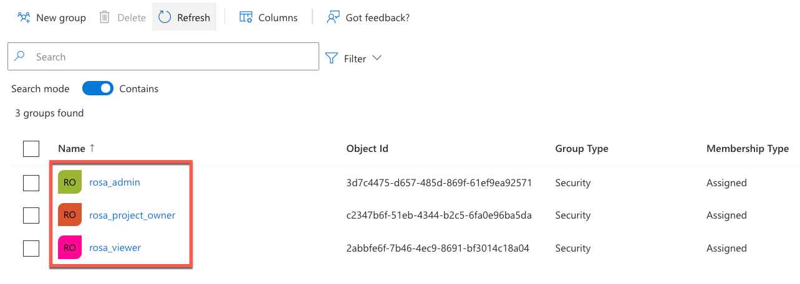
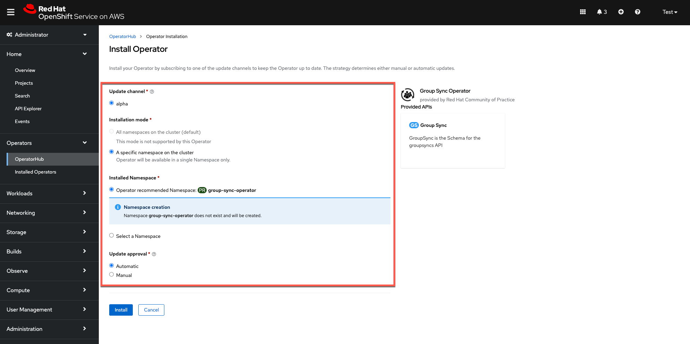
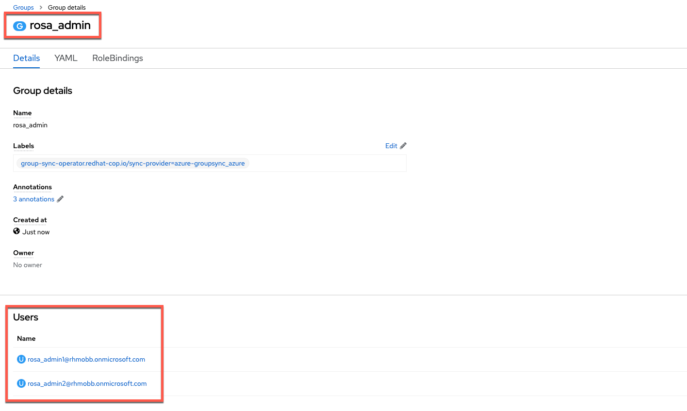

# Using Group Sync Operator with Azure Active Directory and ROSA #

**Steve Mirman**

*8 November 2021*

This guide focuses on how to synchronize Identity Provider (IDP) groups and users after configuring authentication in OpenShift Cluster Manager (OCM). For an IDP configuration example, please reference the [Configure Azure AD as an OIDC identity provider for ROSA/OSD](https://mobb.ninja/docs/idp/azuread/) guide.

To set up group synchronization from Azure Active Directory (AD) to ROSA you must:

1. Define groups and assign users in Azure AD
1. Install the Group Sync Operator from the OpenShift Operator Hub
1. Create and configure a new Group Sync instance
1. Set a synchronization schedule
1. Testing the synchronization process

## Define groups and assign users in Azure AD ##

To synchronize groups and users with ROSA they must exist in Azure AD

1. Create groups to syncronize with ROSA if they do not already exist

    

1. Create user IDs to synchronize with ROSA if they do not already exist 
    
    

1. Assign newly created ussers to the appropriate group  
    
    

## Install the Group Sync Operator from the OpenShift Operator Hub ##

1. In the OpenShift Operator Hub find the **Group Sync Operator**

    

1. Install the operator in the `group-sync-operator` namespace

    

## Create and configure a new Group Sync instance ##

1. Create a new Group Sync instance in the `group-sync-operator` namespace

    

1. Create a new secret named `azure-group-sync` in the **group-sync-operator** namespace. For this you will need the following values:
    - AZURE_SUBSCRIPTION_ID
    - AZURE_TENANT_ID
    - AZURE_CLIENT_ID
    - AZURE_CLIENT_SECRET

1. Using the OpenShift CLI, create the secret using the following format:

        oc create secret generic azure-group-sync \
        --from-literal=AZURE_SUBSCRIPTION_ID=<insert-id> \
        --from-literal=AZURE_TENANT_ID=<insert-id> \
        --from-literal=AZURE_CLIENT_ID=<insert-id> \
        --from-literal=AZURE_CLIENT_SECRET=<insert-secret>
    
1. Using the example below, customize the YAML to match the group names and save the configuration

    

    Sample YAML:
    ```
    apiVersion: redhatcop.redhat.io/v1alpha1
    kind: GroupSync
    metadata:
        name: azure-groupsync
        namespace: group-sync-operator
    spec:
        providers:
            - azure:
                credentialsSecret:
                name: azure-group-sync
                namespace: group-sync-operator
                key: AZURE_CLIENT_SECRET
            groups:
                - rosa_admin
                - rosa_project_owner
                - rosa_viewer
            name: azure
        schedule: '* * * * *'
    ```

## Set a synchronization schedule ##

The Group Sync Operator provides a cron based scheduling parameter for specifying how often the groups and users should be synchronized. This can be set in the instance YAML file during initial configuration or at any time after.

The schedule setting of `schedule: * * * * *` would result in synchronization occuring every minute.

## Testing the synchronization process ##

- Before testing the synchronization, ensure that your Registered Azure Application has permissions for `Group.ReadAll`, `GroupMember.ReadAll`, and `User.ReadAll`

    

- Additionally, check to see if the Group Sync process has completed with a `Condition: ReconcileSuccess` message

    

1. Check to see that all the groups specified in the configuration YAML file show up in the ROSA Groups list

    

1. Validate that all users specified in Azure AD also show up as members of the associated group in ROSA

    

1. Add a new user in Azure AD and assign it to the admin group

    

1. Verify that the user now appears in ROSA (after the specified synchronization time)

    

1. Now delete a user from the Azure AD admin group

    

1. Verify the user has been deleted from the ROSA admin group

    