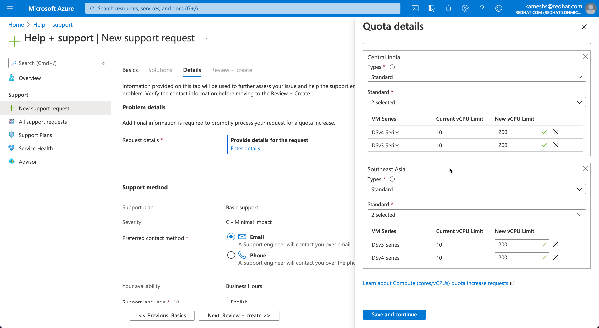

# ROSA Quickstart

A Quickstart guide to deploying a RedHat OpenShift cluster on AWS.

Author: [Steve Mirman](https://twitter.com/stevemirman)

## Video Walkthrough

If you prefer a more visual medium, you can watch [Steve Mirman](https://twitter.com/stevemirman) walk through this quickstart on [YouTube](https://www.youtube.com/watch?v=IFNig_Z_p2Y).

<iframe width="560" height="315" src="https://www.youtube.com/embed/IFNig_Z_p2Y" title="YouTube video player" frameborder="0" allow="accelerometer; autoplay; clipboard-write; encrypted-media; gyroscope; picture-in-picture" allowfullscreen></iframe>


## Prerequisites

### AWS CLI

_You'll need to have an AWS account to configure the CLI against._

**MacOS**

> See [AWS Docs](https://docs.aws.amazon.com/cli/latest/userguide/install-cliv2-mac.html) for alternative install options.

1. Install AWS CLI using the macOS command line

    ```bash
    curl "https://awscli.amazonaws.com/AWSCLIV2.pkg" -o "AWSCLIV2.pkg"
    sudo installer -pkg AWSCLIV2.pkg -target /
    ```

**Linux**

> See [AWS Docs](https://docs.aws.amazon.com/cli/latest/userguide/install-cliv2-linux.html) for alternative install options.

1. Install AWS CLI using the Linux command line

    ```bash
    curl "https://awscli.amazonaws.com/awscli-exe-linux-x86_64.zip" -o "awscliv2.zip"
    unzip awscliv2.zip
    sudo ./aws/install
    ```

**Windows**

> See [AWS Docs](https://docs.aws.amazon.com/cli/latest/userguide/install-cliv2-windows.html) for alternative install options.

1. Install AWS CLI using the Windows command line

    ```bash
    C:\> msiexec.exe /i https://awscli.amazonaws.com/AWSCLIV2.msi
    ```

**Docker**

> See [AWS Docs](https://docs.aws.amazon.com/cli/latest/userguide/install-cliv2-docker.html) for alternative install options.

1. To run the AWS CLI version 2 Docker image, use the docker run command.

    ```bash
    docker run --rm -it amazon/aws-cli command
    ```


### Prepare AWS Account for OpenShift

1. Configure the AWS CLI by running the following command

    ```bash
    aws configure
    ```

2. You will be required to enter an `AWS Access Key ID` and an `AWS Secret Access Key` along with a default region name and output format

    ```bash
    % aws configure
    AWS Access Key ID []: 
    AWS Secret Access Key []: 
    Default region name [us-east-2]: 
    Default output format [json]:
    ```
    The `AWS Access Key ID` and `AWS Secret Access Key` values can be obtained by logging in to the AWS console and creating an **Access Key** in the **Security Credentials** section of the IAM dashboard for your user

3. Validate your credentials 

    ```bash
    aws sts get-caller-identity
    ```
    
    You should receive output similar to the following
    ```
    {
      "UserId": <your ID>,
      "Account": <your account>,
      "Arn": <your arn>
    }
    ```

### Get a Red Hat Offline Access Token

1. Log into cloud.redhat.com

2. Browse to https://cloud.redhat.com/openshift/token/rosa

3. Copy the **Offline Access Token** and save it for the next step

### Set up the ROSA CLI

1. Download the OS specific ROSA CLI from [Red Hat](https://www.openshift.com/products/amazon-openshift/download)

2. Unzip the downloaded file on your local machine

3. Place the extracted `rosa` and `kubectl` executables in your OS path or local directory

4. Log in to ROSA

  ```bash
  rosa login
  ```
 
  You will be prompted to enter in the **Red Hat Offline Access Token** you retrieved earlier and should receive the following message
  
  ```
  Logged in as <email address> on 'https://api.openshift.com'
  ```
  

## Deploy Azure OpenShift

### Variables and Resource Group

Set some environment variables to use later, and create an Azure Resource Group.

1. Set the following environment variables

    > Change the values to suit your environment, but these defaults should work.

    ```bash
    AZR_RESOURCE_LOCATION=eastus
    AZR_RESOURCE_GROUP=openshift
    AZR_CLUSTER=cluster
    AZR_PULL_SECRET=~/Downloads/pull-secret.txt
    ```

1. Create an Azure resource group

    ```bash
    az group create \
      --name $AZR_RESOURCE_GROUP \
      --location $AZR_RESOURCE_LOCATION
    ```


### Networking

Create a virtual network with two empty subnets

1. Create virtual network

    ```bash
    az network vnet create \
      --address-prefixes 10.0.0.0/22 \
      --name "$AZR_CLUSTER-aro-vnet-$AZR_RESOURCE_LOCATION" \
      --resource-group $AZR_RESOURCE_GROUP
    ```

1. Create control plane subnet

    ```bash
    az network vnet subnet create \
      --resource-group $AZR_RESOURCE_GROUP \
      --vnet-name "$AZR_CLUSTER-aro-vnet-$AZR_RESOURCE_LOCATION" \
      --name "$AZR_CLUSTER-aro-control-subnet-$AZR_RESOURCE_LOCATION" \
      --address-prefixes 10.0.0.0/23 \
      --service-endpoints Microsoft.ContainerRegistry
    ```

1. Create machine subnet

    ```bash
    az network vnet subnet create \
      --resource-group $AZR_RESOURCE_GROUP \
      --vnet-name "$AZR_CLUSTER-aro-vnet-$AZR_RESOURCE_LOCATION" \
      --name "$AZR_CLUSTER-aro-machine-subnet-$AZR_RESOURCE_LOCATION" \
      --address-prefixes 10.0.2.0/23 \
      --service-endpoints Microsoft.ContainerRegistry
    ```

1. Disable network policies on the control plane subnet

    > This is required for the service to be able to connect to and manage the cluster.

    ```bash
    az network vnet subnet update \
      --name "$AZR_CLUSTER-aro-control-subnet-$AZR_RESOURCE_LOCATION" \
      --resource-group $AZR_RESOURCE_GROUP \
      --vnet-name "$AZR_CLUSTER-aro-vnet-$AZR_RESOURCE_LOCATION" \
      --disable-private-link-service-network-policies true
    ```

1. Create the cluster

    > This will take between 30 and 45 minutes.

    ```bash
    az aro create \
      --resource-group $AZR_RESOURCE_GROUP \
      --name $AZR_CLUSTER \
      --vnet "$AZR_CLUSTER-aro-vnet-$AZR_RESOURCE_LOCATION" \
      --master-subnet "$AZR_CLUSTER-aro-control-subnet-$AZR_RESOURCE_LOCATION" \
      --worker-subnet "$AZR_CLUSTER-aro-machine-subnet-$AZR_RESOURCE_LOCATION" \
      --pull-secret @$AZR_PULL_SECRET
    ```

1. Get OpenShift console URL

    ```bash
    az aro show \
      --name $AZR_CLUSTER \
      --resource-group $AZR_RESOURCE_GROUP \
      -o tsv --query consoleProfile
    ```

1. Get OpenShift credentials

    ```bash
    az aro list-credentials \
      --name $AZR_CLUSTER \
      --resource-group $AZR_RESOURCE_GROUP \
      -o tsv
    ```

1. Use the URL and the credentials provided by the output of the last two commands to log into OpenShift via a web browser.


1. Deploy an application to OpenShift

    > See the following video for a guide on easy application deployment on OpenShift.

    <iframe width="560" height="315" src="https://www.youtube.com/embed/8uFUFJS9TA4?start=0:43" title="YouTube video player" frameborder="0" allow="accelerometer; autoplay; clipboard-write; encrypted-media; gyroscope; picture-in-picture" allowfullscreen></iframe>

### Delete Cluster

Once you're done its a good idea to delete the cluster to ensure that you don't get a surprise bill.

1. Delete the cluster

    ```bash
    az aro delete -y \
      --resource-group $AZR_RESOURCE_GROUP \
      --name $AZR_CLUSTER
    ```

1. Delete the Azure resource group

    > Only do this if there's nothing else in the resource group.

    ```bash
    az group delete -y \
      --name $AZR_RESOURCE_GROUP
    ```

## Adendum

### Adding Quota to ARO account



1. [Create an Azure Support Request](https://portal.azure.com/#blade/Microsoft_Azure_Support/HelpAndSupportBlade/newsupportrequest)

1. Set **Issue Type** to "Service and subscription limits (quotas)"

1. Set **Quota Type** to "Compute-VM (cores-vCPUs) subscription limit increases"

1. Click **Next Solutions >>**

1. Click **Enter details**

1. Set **Deployment Model** to "Resource Manager

1. Set **Locations** to "(US) East US"

1. Set **Types** to "Standard"

1. Under **Standard** check "DSv3" and "DSv4"

1. Set **New vCPU Limit** for each (example "60")

1. Click **Save and continue**

1. Click **Review + create >>**

1. Wait until quota is increased.
